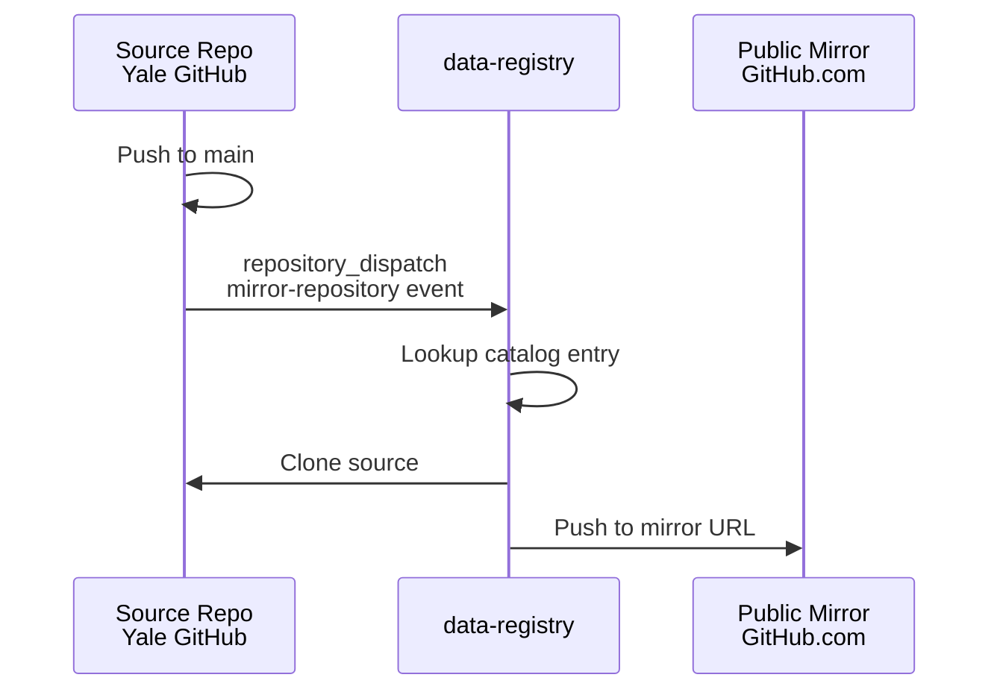

# Mirror Repository Sync - Testing Guide

This document provides comprehensive testing instructions for the mirror repository synchronization functionality implemented across the mint ecosystem.

## Overview

The mirror sync system enables automatic synchronization of private Yale GitHub repositories to public GitHub.com mirrors for external collaboration. It consists of:

- **Central Mirror Workflow**: Runs in the `data-registry` repository
- **Trigger Workflows**: Installed in source repositories to initiate mirroring
- **Catalog Configuration**: Defines mirror URLs and purposes

## Architecture



## Prerequisites

### Required Secrets in `data-registry` repository:
- **`PUBLIC_GITHUB_TOKEN`**: Personal Access Token with push access to public GitHub.com repos
- **`ORG_ADMIN_TOKEN`**: Token with access to private Yale GitHub repos

### Required Setup:
1. Public mirror repositories must exist at the URLs specified in catalog entries
2. Source repositories need trigger workflows installed (optional for automated syncing)

## Test Scenarios

### 1. Manual Mirror Test

**Purpose**: Verify the core mirroring functionality works correctly

**Steps**:
1. Navigate to the `data-registry` repository on GitHub
2. Go to **Actions** tab
3. Select **"Mirror Repository to Public GitHub"** workflow
4. Click **"Run workflow"**
5. Fill in parameters:
   - **Source repository**: `data_cms-provider-data-service`
   - **Source organization**: `cooper-lab`
6. Click **"Run workflow"**

**Expected Results**:
- Workflow runs successfully
- Public mirror repository receives the latest commit
- Workflow logs show successful clone and push operations

### 2. Catalog Entry Validation Test

**Purpose**: Ensure catalog entries are properly configured

**Steps**:
1. Check the catalog entry: `catalog/data/cms-provider-data-service.yaml`
2. Verify mirror configuration:
   ```yaml
   repository:
     mirror:
       url: https://github.com/cooper-lab-public/cms-provider-data-service
       purpose: external_collaboration
   ```

**Expected Results**:
- Catalog validates successfully
- Mirror URL is accessible (if repository exists)
- Registry validation passes

### 3. Automated Trigger Test

**Purpose**: Test the end-to-end automated workflow

**Setup**:
1. Install the trigger workflow in a source repository:
   - Copy `mint_registry/templates/workflows/trigger-mirror.yml.j2`
   - Generate actual workflow with registry_org = "cooper-lab"
   - Save as `.github/workflows/trigger-mirror.yml`

**Test Steps**:
1. Make a small change to the source repository (add a comment, etc.)
2. Commit and push to the main branch
3. Check the Actions tab of the source repository
4. Verify the trigger workflow ran successfully
5. Check the Actions tab of the `data-registry` repository
6. Verify the mirror workflow was triggered and completed

**Expected Results**:
- Trigger workflow completes without errors
- Mirror workflow is automatically started
- Public mirror is updated with the new commit

### 4. Error Handling Tests

#### Test: Invalid Catalog Entry
1. Temporarily modify a catalog entry to have an invalid mirror URL
2. Run manual mirror workflow
3. Verify workflow fails gracefully with clear error messages

#### Test: Missing Public Repository
1. Try to mirror to a non-existent public repository
2. Verify workflow fails with appropriate error message
3. Check that source repository is not affected

#### Test: Permission Issues
1. Temporarily revoke permissions from PUBLIC_GITHUB_TOKEN
2. Run mirror workflow
3. Verify workflow fails with clear permission error
4. Restore permissions and verify it works again

## Validation Commands

### Check Workflow Status
```bash
# Check if workflows exist
ls -la .github/workflows/

# Validate workflow syntax
gh workflow run --list
```

### Verify Catalog Entry
```bash
# Check catalog file exists
ls -la catalog/data/cms-provider-data-service.yaml

# Validate YAML syntax
python3 -c "import yaml; yaml.safe_load(open('catalog/data/cms-provider-data-service.yaml'))"
```

### Test Mirror URL Access
```bash
# Extract mirror URL from catalog
MIRROR_URL=$(python3 -c "
import yaml
with open('catalog/data/cms-provider-data-service.yaml') as f:
    data = yaml.safe_load(f)
print(data['repository']['mirror']['url'])
")

# Test URL accessibility
curl -I $MIRROR_URL
```

## Troubleshooting

### Common Issues

1. **Workflow doesn't trigger**:
   - Check that trigger workflow is installed in source repo
   - Verify repository_dispatch permissions
   - Check that push is to main/master branch

2. **Mirror workflow fails**:
   - Verify PUBLIC_GITHUB_TOKEN has push access to mirror repo
   - Check that mirror repository exists
   - Ensure ORG_ADMIN_TOKEN can access source repository

3. **Catalog validation fails**:
   - Check YAML syntax
   - Verify mirror URL format
   - Ensure all required fields are present

### Debug Steps

1. Check workflow logs in GitHub Actions
2. Verify secret configuration in repository settings
3. Test manual workflow dispatch first
4. Check network connectivity and token permissions

## Success Criteria

- [ ] Manual mirror workflow runs successfully
- [ ] Public mirror receives commits from source repository
- [ ] Automated trigger works when installed in source repos
- [ ] Error handling works correctly
- [ ] Catalog validation passes
- [ ] All secrets are properly configured

## Next Steps After Testing

1. Install trigger workflows in production repositories that need mirroring
2. Configure additional catalog entries for other repositories
3. Set up monitoring and alerting for mirror failures
4. Document the process for repository maintainers
5. Consider adding mirror status reporting to catalog entries

---

**Last Updated**: $(date)
**Tested By**: [Your Name]
**Test Environment**: GitHub Actions, Yale GitHub + GitHub.com


